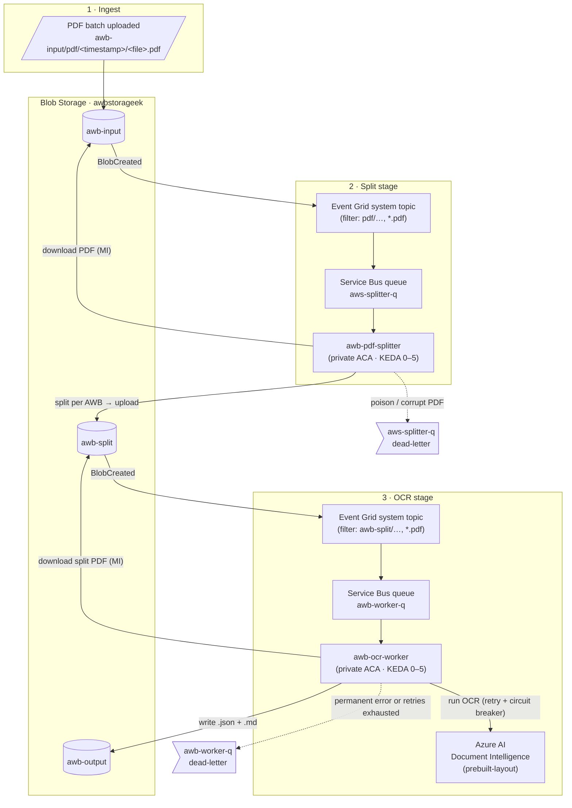
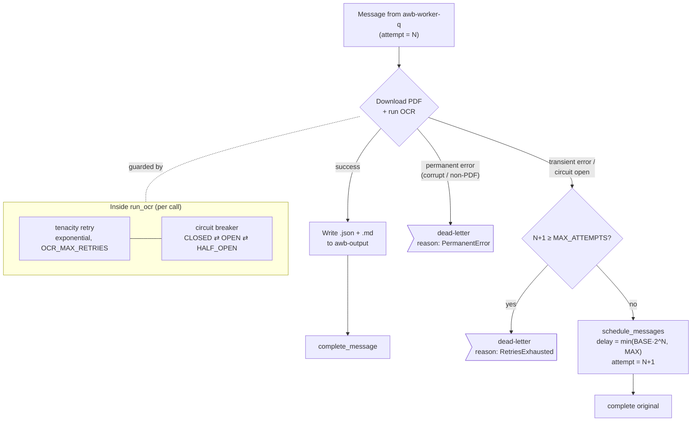
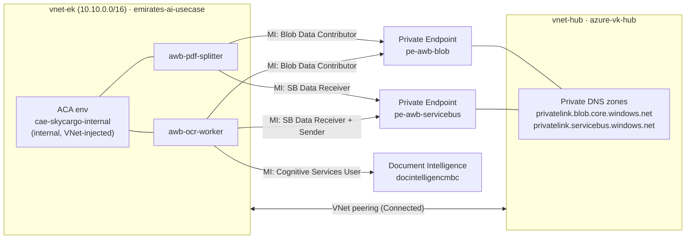

# SkyCargo AWB Processing — End-to-End Workflow

Private, event-driven pipeline that ingests multi-AWB PDF batches, splits them
into individual Air Waybills, runs OCR, and stores structured results — all over
private networking with managed-identity (keyless) auth.

## Pipeline overview

## OCR worker reliability (retry → backoff → dead-letter)

## Networking & identity

## Key components

| Component | Resource | Notes |
|-----------|----------|-------|
| Input container | `awbstorageek/awb-input` | Watched by Event Grid (prefix `pdf/`). |
| Split container | `awbstorageek/awb-split` | Split outputs; watched → `awb-worker-q`. Separate container breaks recursion. |
| Output container | `awbstorageek/awb-output` | OCR `.json` + `.md`; not watched. |
| Splitter queue | `awb-sb-ek/aws-splitter-q` | Drives `awb-pdf-splitter`. |
| Worker queue | `awb-sb-ek/awb-worker-q` | Drives `awb-ocr-worker`. |
| Splitter app | `awb-pdf-splitter` (ACA) | Internal ingress, KEDA on `aws-splitter-q`. |
| OCR app | `awb-ocr-worker` (ACA) | Internal ingress, KEDA on `awb-worker-q`. |
| OCR backend | `docintelligencmbc` | Document Intelligence `prebuilt-layout`. |
| ACA environment | `cae-skycargo-internal` | VNet-injected into `vnet-ek`, internal only. |

All cross-service calls use **system-assigned managed identities** (no keys or
connection strings) and travel over **private endpoints** resolved through the
hub VNet's Private DNS zones.
